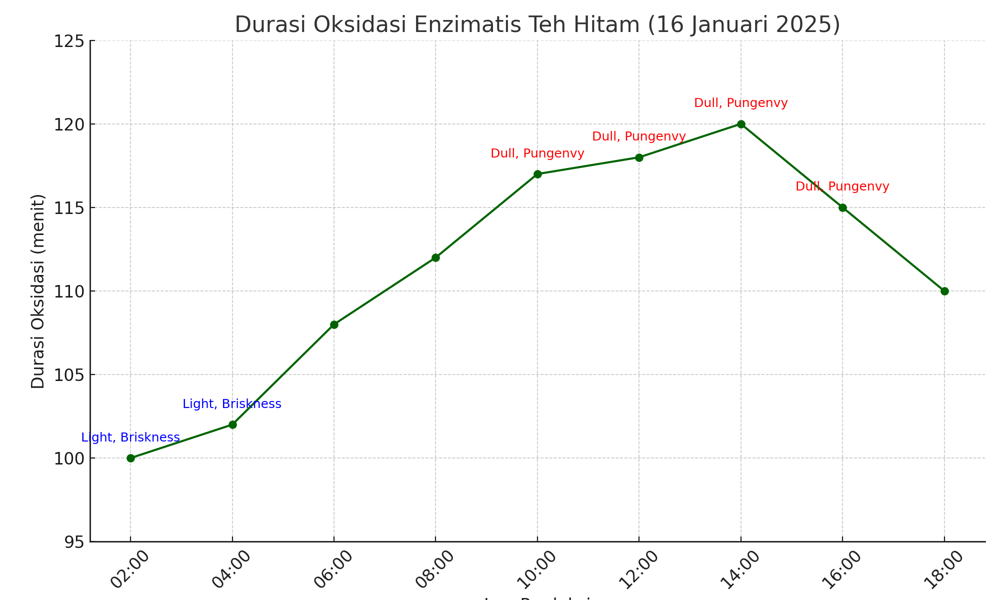

# Tea Production Analysis
Simulated data analysis of black tea production at PT Perkebunan Nusantara I Regional II – Malabar

This project is a simulated data analysis based on my field internship experience at PT Perkebunan Nusantara I Regional II – Malabar. It focuses on the environmental factors that influence the enzymatic oxidation process in black tea production.

## Dataset Overview
The dataset (16 January 2025) includes:
- Oxidation time for 4 beds (in minutes)
- Room temperature and humidity
- Internal and external tea powder temperatures
- Tea leaf spreading thickness

Data was collected hourly over a 14-hour shift during enzymatic oxidation monitoring.

## Objective
- Explore trends in oxidation parameters
- Understand how temperature & humidity affect oxidation timing
- Visualize potential inefficiencies or deviations

## Tools
- Microsoft Excel
- (Optional) Python: pandas, matplotlib

## Interpretasi Kualitas Teh Berdasarkan Durasi Oksidasi

The longer the enzymatic oxidation, the duller the color of the tea infusion and the more pungent the taste.  
If the oxidation is too short, the color is still light, the taste is brisk, and the sediment is greenish.  
This supports the theory of the conversion of polyphenols into theaflavins and thearubigins (Hamida et al., 2022).

## Files
- `tea_production_simulated.xlsx`: main data file used in analysis
- []
- `tea_oxidation_analysis.ipynb`

## Author
Cychie Lestary – Bioprocess Engineering student at Universitas Brawijaya  
